# Grupo de Invetimentos
- Sitema de gestão de grupos de investimentos financeiros
- Projeto para a disciplina de Laboratório de Banco de dados IV
- Faculdade FATEC SJC

## Project setup
- Istalar a stack apache, php, mysql(LAMP ou XAMPP, para ese sistema, foi utilizado o XAMPP)
- Iniciar o servidor
- Iniciar o banco de dados
- Realizar os comandos:

```
php artisan migrate:fresh
php artisan db:seed
php artisan serve
```

- acessar a rota **127.0.0.1:8000/login**

- login admin: joaozinho@sistema.com
- senha admin: 123456


### Tela de Login
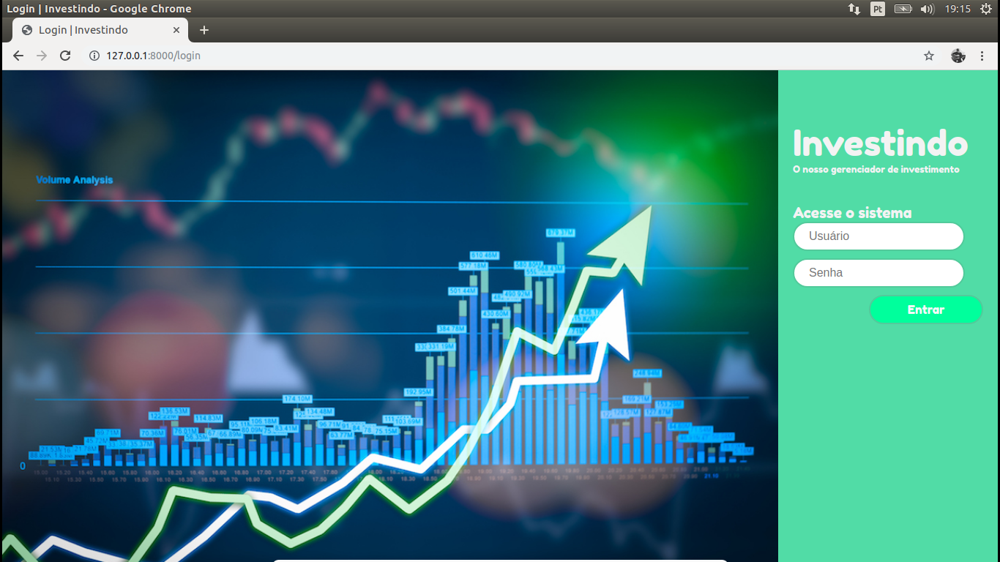

### Tela de Usuário
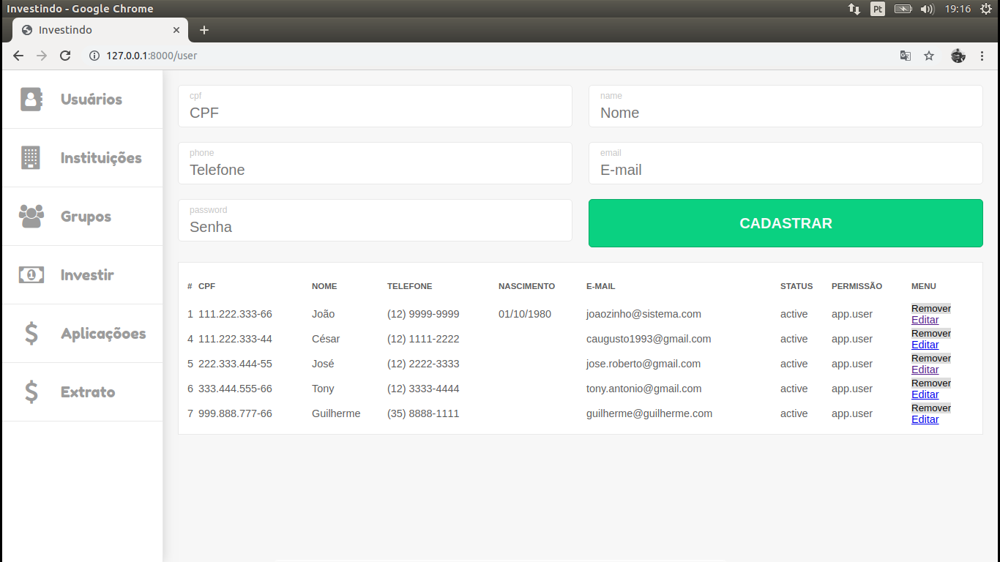

### Cadastro de Usuário


### Usuário Cadastrado
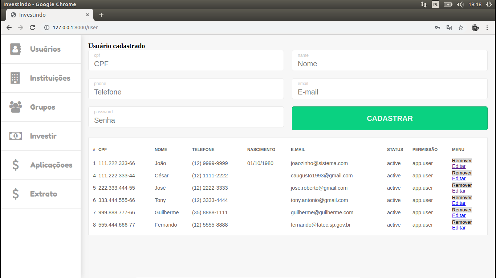

### Tela de Instituição
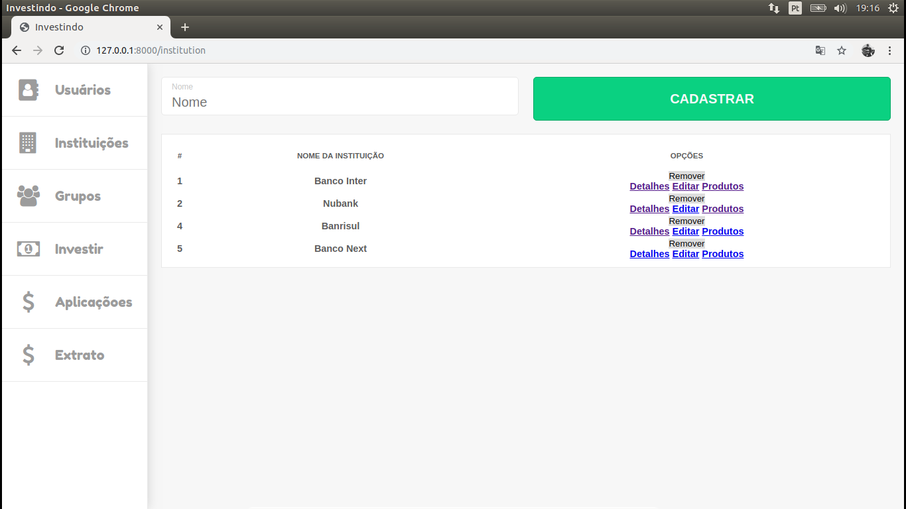

### Cadastro de Instituição


### Instituição Cadastrada
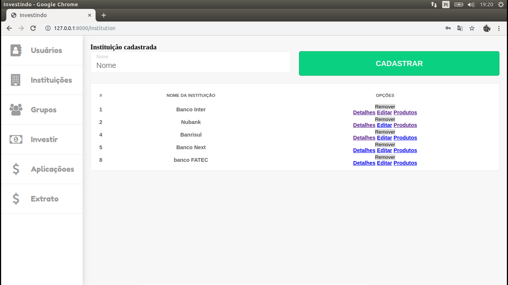

### Tela de Grupos de Investimento
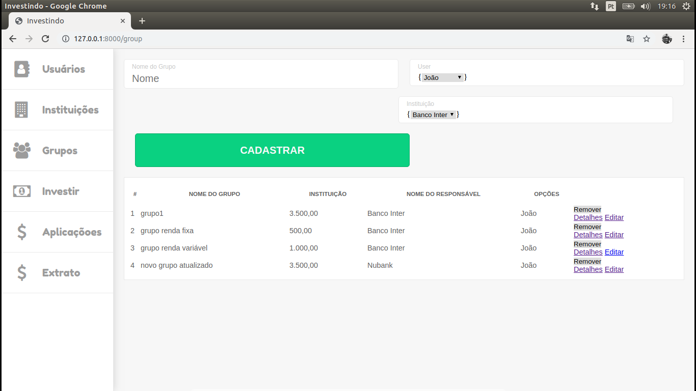

### Criando novo Grupo de Investimento


### Grupo de Investimento Cadastrado


### Relacionando Usuário a Grupo de Investimento
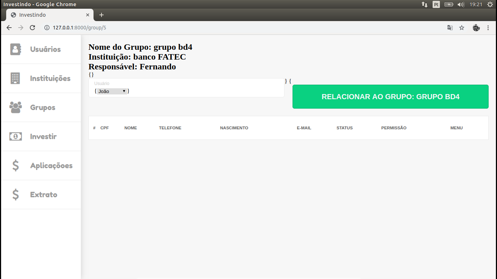

### Listando Usuários Relacionados a Grupo de INvestimento
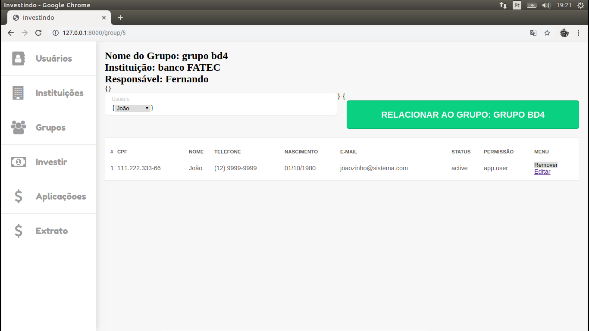

### Cadastrando novo produto
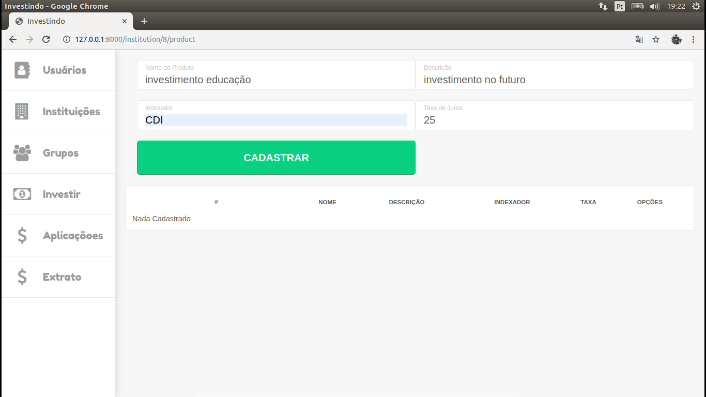

### Produto cadastrado
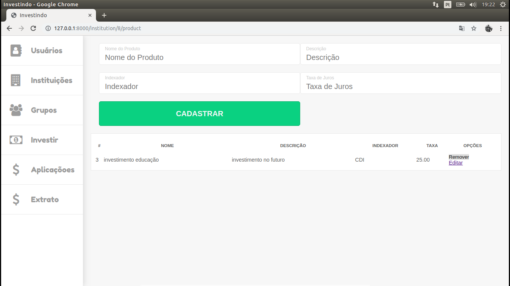

### Realizando Investimento
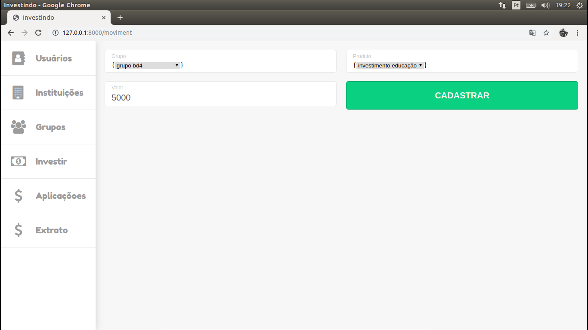

### Investimento Realizado
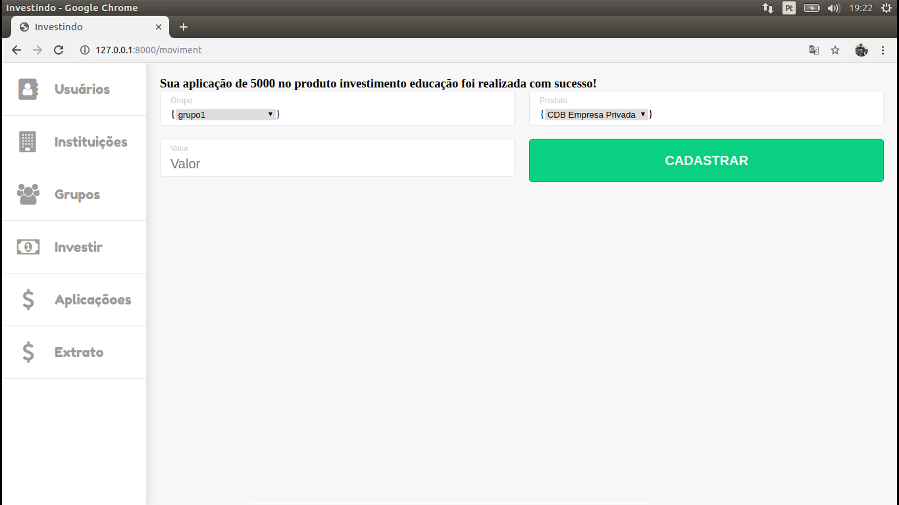

### Listando Investimentos de cada Grupo


### Mostrando extrato do Usuário
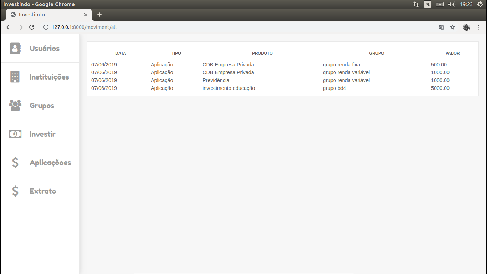
