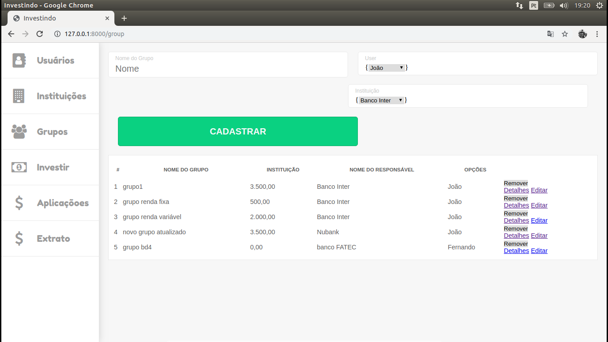

# Grupo de Invetimentos
- Sitema de gestão de grupos de investimentos financeiros
- projeto para a disciplina de Laboratório de Banco de dados IV
- Faculdade FATEC SJC

### Tela de Login

### Tela de Usuário

### Cadastro de Usuário

### Usuário Cadastrado

### Tela de Instituição

### Cadastro de Instituição

### Instituição Cadastrada

### Tela de Grupos de Investimento

### Criando novo Grupo de Investimento

### Grupo de Investimento Cadastrado

### Relacionando Usuário a Grupo de Investimento

### Listando Usuários Relacionados a Grupo de INvestimento

### Cadastrando novo produto

### Produto cadastrado

### Realizando Investimento

### Investimento Realizado

### Listando Investimentos de cada Grupo

### Mostrando extrato do Usuário

