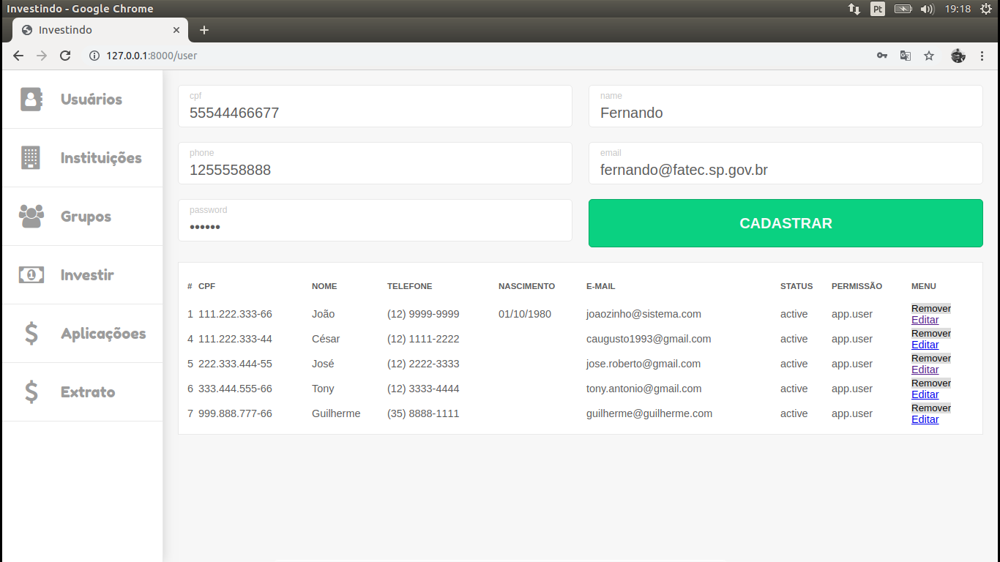

# Projeto-Investimento
- Sistema de gestão de grupos de investimentos financeiros
- Projeto para a disciplina de Laboratório de Banco de dados IV
- Faculdade FATEC SJC

## Integrantes
- César Augusto Santos de Almeida
- Caio Campos Martinelli
- José Roberto Alves Junior

## Pacotes de terceiros utilizados
- l5-Repository - andersao/l5-repository -versão: ^2.6

## Project setup
- Clonar através do comando:

```
git clone https://github.com/cesaralmeida93/projeto-investimento.git
```

- Instalar a stack apache, php, mysql(LAMP ou XAMPP, para ese sistema, foi utilizado o XAMPP)

Se necessário edite o arquivo *.env* e ajuste os seguintes parâmetros
DB_DATABASE=test
DB_USER=root
DB_PASSWORD=

*OBS:* Não se esqueça de criar o banco de dados no SGBD MySQL.

- Iniciar o servidor
- Iniciar o banco de dados
- Realizar os comandos:

```
composer install
php artisan key:generate
php artisan migrate:fresh
php artisan db:seed
php artisan serve
```

- acessar a rota **127.0.0.1:8000/login**

- login admin: joaozinho@sistema.com
- senha admin: 123456

- abaixo seguem prints de cada funcionalidade do sistema

### Tela de Login


### Tela de Usuário


### Cadastro de Usuário


### Usuário Cadastrado


### Tela de Instituição


### Cadastro de Instituição


### Instituição Cadastrada


### Tela de Grupos de Investimento


### Criando novo Grupo de Investimento


### Grupo de Investimento Cadastrado


### Relacionando Usuário a Grupo de Investimento


### Listando Usuários Relacionados a Grupo de INvestimento


### Cadastrando novo produto


### Produto cadastrado


### Realizando Investimento


### Investimento Realizado


### Listando Investimentos de cada Grupo


### Mostrando extrato do Usuário

